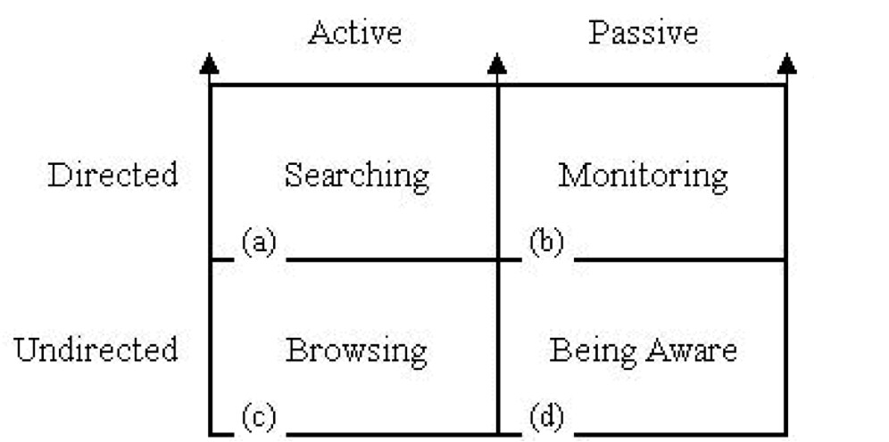

# 資訊架構的本質

## 1. 有兩個重要的腳色
1. 人: 尋求資訊的人
2. 資訊: 人所期望得到的資訊

## 資訊需求
1. 真正想要的資訊
2. 新奇,偶然發現的資訊
3. 重新獲得曾經得到的資訊
4. 遍覽所有相關的資訊

## 資訊需求背後的動機
1. 尋求答案(Seeking Answer)
   * 有明確的需要和方向
   * 能夠描述出來,當正確答案出現時,能馬上識別
2. 降低不確定性(Reducing Incertainty)
   * 對於需求的理解很模糊,無法很準確的描述
   * 需要摸索,最終目標可能在探索的過程中不斷改變
3. 建立意義(Making Sense)
   * 沒有方向,也沒有目標,甚至有情緒波動
   * 需要找到定位: 客觀上降低不確定性,但主觀情緒常波動
   * 常見的是: 新聞
4. 再次尋找(Re-finding)
   * 有極為明確的目標,但忘了關鍵屬性,只記得部份屬性和尋找歷程
   * 再次尋找看過的資訊

## 需求表達
1. 內在(Visceral Need): 無法用言語表達,但是明確能感受到問題
2. 意識(Conscious Need): 可以用語言表達,但可能說不清楚
3. 正規化(Formalized Need): 能夠清晰的用語言表達,但其形式可能與資訊來源不符合
4. 妥協(Compromized Need): 配合資訊來源的格式、類型、限制。

## 資訊查找

1. 搜尋: 主動,知道目標
=> 需求的表達有達到正規化(Formalization)的程度
2. 關注: 被動,知道目標
=> 不急迫的需求,預備好接收資訊
3. 瀏覽: 主動,無特定目標
=> 好奇心驅動,將自己曝露在可能有新鮮資訊之處
4. 知悉: 被動,無特定目標
=> 隨機碰觸不同資訊,很多的學習機會都來自這種模式

Bates採莓法:

- 探索、多種尋求模式的組合
- 會在: 查詢-取得資訊-有了新問題-思考 這個迴圈圍繞很久,但是每次